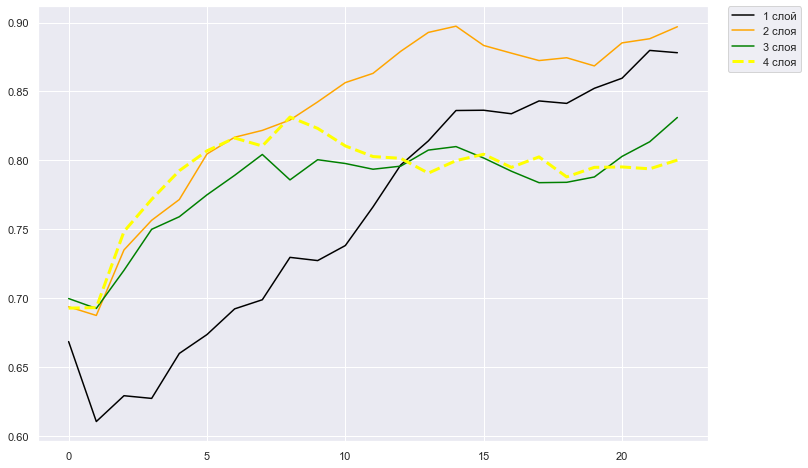
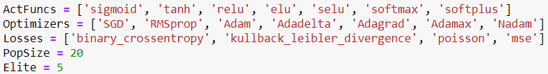

# Генетический алгоритм для оптимизации гиперпараметров нейронной сети
Результаты работы генетического алгоритма для нейросетей с 1-4 скрытыми слоями:

Параметры, возможные для изменения

Параметры генетического алгоритма:
* ActFuncs - возможные активационные функции НС;
* Optimizers - возможные алгоритмы обучения НС;
* Losses - возможные функции ошибок НС;
* PopSize - размер популяции ГА;
* Elite - количество элитных особей ГА;